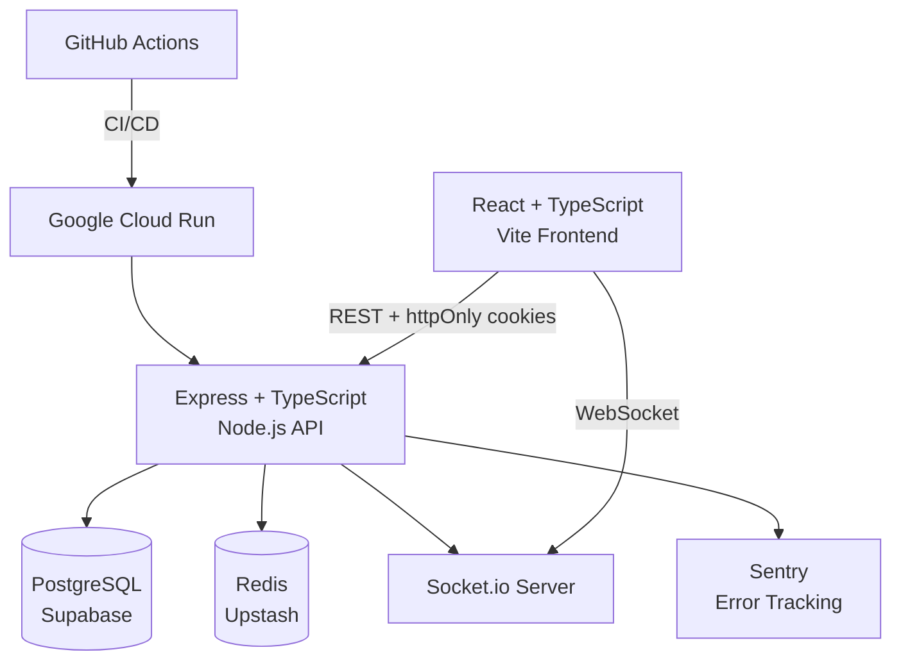

# DevOps Dashboard

A full-stack team metrics and developer tools platform built to production quality. Features JWT authentication, real-time updates via WebSockets, Redis caching, rate limiting, and automated CI/CD deployment to Google Cloud Run.

**Live API:** https://devops-dashboard-985792054692.us-east1.run.app  
**API Docs:** https://devops-dashboard-985792054692.us-east1.run.app/api/docs

---

## Architecture



---

## Tech Stack

| Layer | Technology | Why |
|-------|-----------|-----|
| Frontend | React + TypeScript + Vite | Fast dev server, first-class TS support |
| Backend | Node.js + Express + TypeScript | Full-stack JS, strong ecosystem |
| Database | PostgreSQL + Prisma ORM | Relational model, type-safe queries, migrations |
| Auth | JWT + httpOnly cookies | Stateless, XSS-resistant token storage |
| Real-time | Socket.io | WebSocket server with fallback support |
| Caching | Redis (Upstash) | Rate limiting + response caching across instances |
| Hosting | Google Cloud Run | Container-based, scales to zero, zero idle cost |
| Database hosting | Supabase | Managed PostgreSQL, free tier |
| CI/CD | GitHub Actions + Docker | Automated test, build, and deploy on push |
| Error tracking | Sentry | Automatic 5xx capture with stack traces |

---

## Features

- **JWT authentication** — access tokens in memory, refresh tokens in httpOnly cookies, token rotation on every refresh
- **Role-based route protection** — `authenticate` middleware guards all protected endpoints
- **Real-time dashboard** — Socket.io activity feed with live updates
- **Redis caching** — `/me` endpoint cached with 5-minute TTL, invalidated on write
- **Rate limiting** — Redis-backed, works correctly across multiple Cloud Run instances
- **Structured logging** — Pino JSON logs with request method, URL, status, and duration
- **Centralized error handling** — `AppError` for 4xx, unknown errors caught and reported to Sentry
- **Health check endpoint** — live DB + Redis dependency checks, 503 on degraded state
- **94% test coverage** — Jest + Supertest integration tests, isolated test database
- **Workload Identity Federation** — no long-lived GCP credentials stored in CI

---

## Local Development

### Prerequisites

- Node.js 20+
- Docker Desktop (for Redis)
- PostgreSQL 18

### Setup

```bash
# Clone the repo
git clone https://github.com/Str8-88s/devops-dashboard.git
cd devops-dashboard

# Install dependencies
npm install

# Start Redis
docker compose up -d

# Configure environment
cp .env.example .env
# Fill in DATABASE_URL, JWT_ACCESS_SECRET, JWT_REFRESH_SECRET, REDIS_URL

# Run migrations
npx prisma migrate dev

# Start the API
npm run dev

# Start the frontend (separate terminal)
cd client
npm install
npm run dev
```

API runs on `http://localhost:3000`  
Frontend runs on `http://localhost:5173`  
Swagger UI at `http://localhost:3000/api/docs`

---

## API Reference

Full interactive documentation available at:  
**https://devops-dashboard-985792054692.us-east1.run.app/api/docs**

### Auth Endpoints

| Method | Endpoint | Description | Auth |
|--------|----------|-------------|------|
| POST | `/api/auth/register` | Register a new user | — |
| POST | `/api/auth/login` | Login, returns access token + sets refresh cookie | — |
| POST | `/api/auth/refresh` | Rotate refresh token, return new access token | Cookie |
| POST | `/api/auth/logout` | Invalidate refresh token | Cookie |

### User Endpoints

| Method | Endpoint | Description | Auth |
|--------|----------|-------------|------|
| GET | `/api/users/me` | Get current user profile (cached) | Bearer |
| POST | `/api/users` | Create user | — |
| GET | `/api/users/:id` | Get user by ID | Bearer |
| PUT | `/api/users/:id` | Update user | Bearer |
| DELETE | `/api/users/:id` | Delete user | Bearer |

---

## Testing

```bash
# Run all tests
npm test

# With coverage report
npm run test:coverage
```

Tests use a separate `devops_dashboard_test` database. All suites run serially (`--runInBand`) to prevent race conditions on the shared test database.

---

## Deployment

Deployments are fully automated via GitHub Actions on every push to `main`:

1. Install dependencies
2. Generate Prisma client
3. Type check
4. Run test suite against test database
5. Build Docker image
6. Push to GCP Artifact Registry
7. Deploy to Cloud Run

GCP authentication uses Workload Identity Federation — no long-lived service account keys stored anywhere.

---

## Key Technical Decisions

A full decision log is maintained in [`docs/decisions.md`](docs/decisions.md). Selected highlights:

**Prisma v7** requires an explicit database adapter (`@prisma/adapter-pg`) passed to the `PrismaClient` constructor — the implicit connection handling from v6 was removed entirely.

**Token storage** — access tokens live in memory (eliminated XSS exposure), refresh tokens in httpOnly cookies (inaccessible to JavaScript). Token rotation on every refresh means replay attacks fail immediately.

**Redis-backed rate limiting** — in-memory rate limiting resets on process restart and doesn't share state across Cloud Run instances. Redis solves both problems with minimal added complexity.

**Workload Identity Federation over service account keys** — GCP org policy blocked key creation, which turned out to be the better approach anyway. GitHub Actions proves identity via short-lived OIDC tokens; no credentials stored anywhere.

**Supabase over Cloud SQL** — Cloud SQL costs ~$12-15/month at idle. Supabase is managed PostgreSQL on the free tier. Zero refactoring required since Prisma abstracts the connection.

---

## Project Structure

```
devops-dashboard/
├── src/
│   ├── __tests__/        # Integration tests
│   ├── controllers/      # Route handlers
│   ├── lib/              # Shared modules (prisma, redis, logger, socket, sentry)
│   ├── middleware/        # Auth, validation, error handling
│   ├── routes/           # Express routers with Swagger annotations
│   ├── schemas/          # Zod validation schemas
│   ├── app.ts            # Express app setup
│   └── index.ts          # HTTP server + SIGTERM handler
├── client/               # React + TypeScript frontend
├── prisma/               # Schema and migrations
├── docs/                 # Decision log
├── .claude/              # AI session context
├── .github/workflows/    # CI/CD pipeline
├── docker-compose.yml    # Local Redis
└── Dockerfile
```

---

## Author

Built by [Str8-88s](https://github.com/Str8-88s) as a portfolio project demonstrating production-quality full-stack development.
